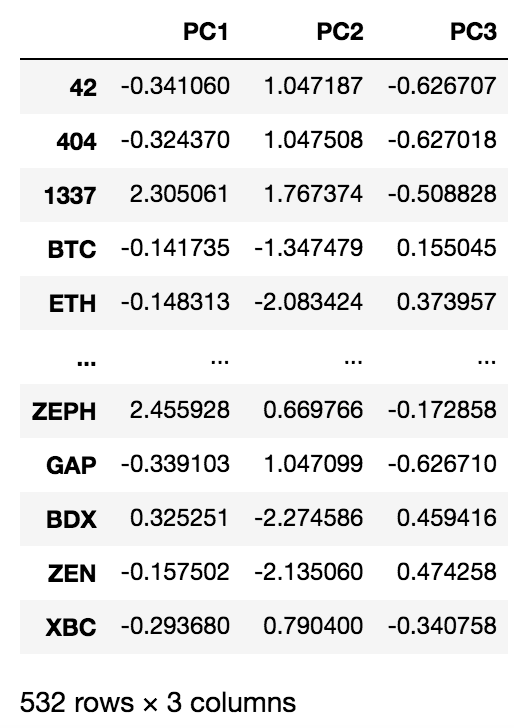
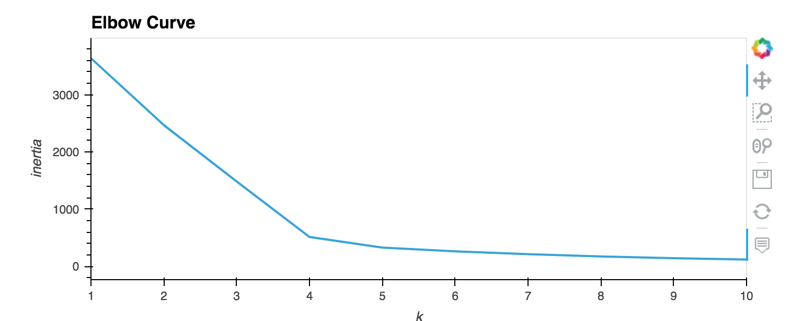
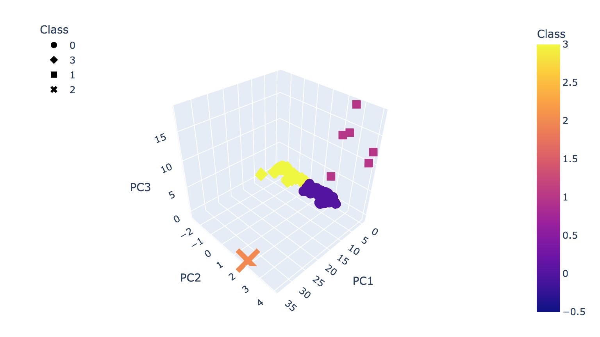
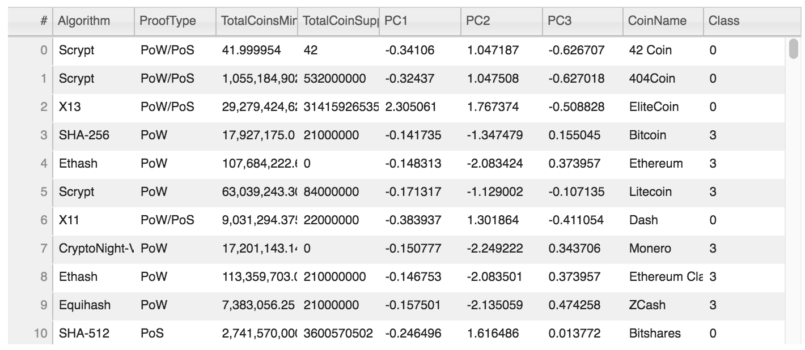
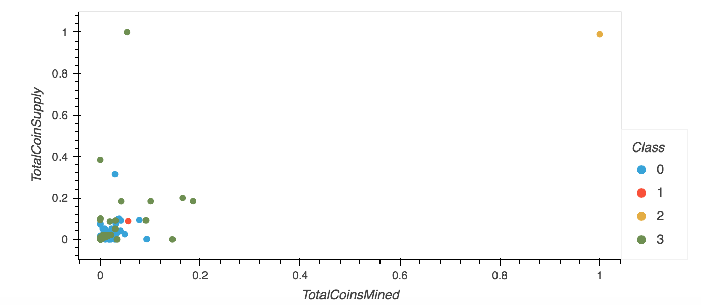

# CryptoCurrencies
## Project Overview 
Our goal here is to use unsupervised machine learning to create a report that includes what cryptocurrencies are on the trading market, as well as how they could be grouped to create a classification system. This report can then be used by banks for future cryptocurrency investment purposals. After analyzing the database, the following steps will be taken to complete the analysis report:

- Preprocess the data for PCA 
- Reduce data dimensions using the PCA algorithm
- Cluster cryptocurrencies using K-means
- Visualize cryptocurrencies results 

## Results 
### Prepocessing data and reducing dimensions with PCA
After cleaning the data and reducing data dimensions to three principal components using the PCA algorithm, we were left with **_532 tradable cryptocurrencies_**. 

### Clustering cryptocurrencies using K-means
Because we are unsure of the output for this analysis, hence the reason for using unsupervised machine learning, we created an elbow curve using the K-means method to help identify the the number of clusters that should be used for our data. 

Based on the curve we produced, we will use 4 clusteres to categorize the cryptocurriences. This is because best k value on the curve is 4. 

### Visualizing Cryptocurrencies Results
A 3D scatter plot was created using the reduced data dimensions (PC1, PC2, PC3). The plot is categorized by crytocurrency "class".

The table below holds all tradable crytocurrencies.

Lastly, we created a two-dimensional scatter plot by plotting only 2 cryptocurrecny features, TotalCoinSuppy and TotalCoinsMined. It is clear that plotting the data in such manner does not result in useful analysis, seeing how there seems to be no difference between the 4 classes. 
